
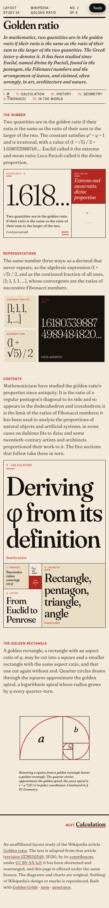

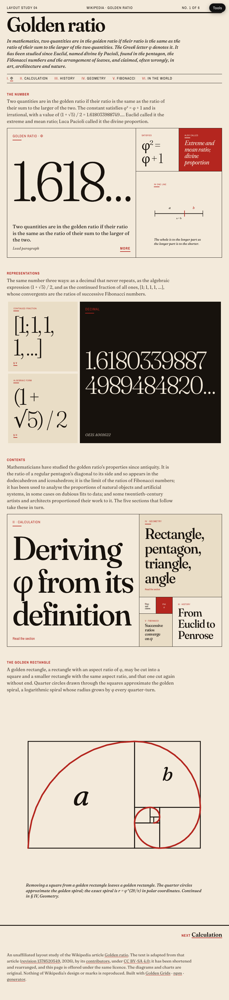

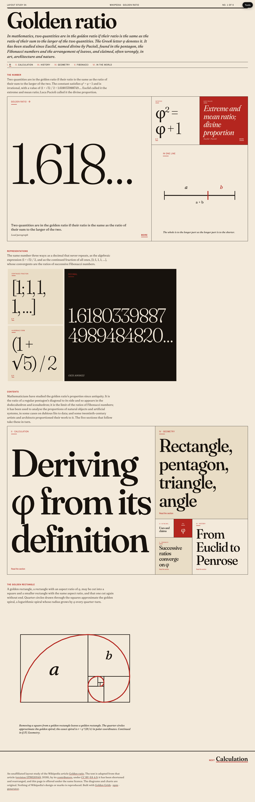

# Layout study 04 — Wikipedia: Golden ratio

**Live:** https://gregoryedgerton.github.io/golden-grids-study-04-wikipedia/

An unaffiliated layout study of the Wikipedia article
[Golden ratio](https://en.wikipedia.org/wiki/Golden_ratio). It takes one
long article apart into six pages of golden grids, one fact per square, with
type that fits its square, and asks whether a text-driven reference page can
be read that way at all. The program brief committed to Wikipedia as the
series' honest failure; this study is where that is tested.

Built with [Golden Grids](https://github.com/gregoryedgerton/golden-grids)
([npm](https://www.npmjs.com/package/@gifcommit/golden-grids) ·
[generator](https://gregoryedgerton.github.io/golden-grids/)), from the
[study template](https://github.com/gregoryedgerton/golden-grids-study-template).

> **Status: built and live.** Six pages, seventeen bands, seven of the eight
> `placement` × `clockwise` orientations, a placeholder band and a `single`
> band. Text adapted from the article; seven original figures. What remains
> is the written post and the reading test described under *What did not*.

---

## Licence and attribution

The text on these pages is adapted from the Wikipedia article *Golden ratio*,
[revision 1378520549](https://en.wikipedia.org/w/index.php?title=Golden_ratio&oldid=1378520549),
by its [contributors](https://en.wikipedia.org/w/index.php?title=Golden_ratio&action=history),
under [CC BY-SA 4.0](https://creativecommons.org/licenses/by-sa/4.0/). It has
been shortened and rearranged; the pages are offered under the same licence,
and every page says so in its colophon. This is the one study in the series
that uses the reference's text, which the program brief allows because the
licence does. The figures and charts are original, drawn from the
mathematics in [`src/diagrams/index.tsx`](src/diagrams/index.tsx). Nothing of
Wikipedia's design, marks or images is reproduced; the typefaces are
Fraunces and Archivo Narrow, from Google Fonts.

## Reference

**Page:** https://en.wikipedia.org/wiki/Golden_ratio, signed out, 2026-10-05.
Captures at 390 / 820 / 1440 are in [`captures/`](captures/), with a `.json`
of headings and image boxes beside each; the article's wikitext and a plain
extract are kept there too, as the source the pages were cut from.

| Width | Reference | Study, page I |
| --- | --- | --- |
| 390px |  |  |
| 820px |  |  |
| 1440px |  |  |

The other five pages are captured as `study-<page>-<width>.png`.

## The claim

A text-driven article can be read as a hierarchy of facts rather than a
column of prose, if each square holds one fact and the type is set to the
square; and the golden ratio is the one subject on which a golden grid is
not a metaphor, because the squares on screen are the squares in the
article's figures.

## Structural inventory

Measured from the captures. The reference is one column of 16px serif at
every width, with a 250px rail of figures on the right at 1440 and the
figures inlined at 820 and 390.

| | 390 | 820 | 1440 |
| --- | --- | --- | --- |
| Page height | 66,232px | 34,562px | 29,989px |
| Headings | 32 | 32 | 32 |
| Images | 174 | 177 | 177, of which 96 wider than 120px |
| Type sizes in the body | one | one | one |

Most of the images are rendered formulae. The article has ten top-level
sections; this study takes the lead and five of them (Calculation, History,
Geometry, the Fibonacci relationship, Applications with Disputed
observations) and leaves the proofs of irrationality, the minimal polynomial,
the algebraic conjugate, the Penrose tilings, the dodecahedron and the
further-reading apparatus unrebuilt. They are not flat; they are long, and
the study is not a replacement for the article.

## Pages and bands

Six HTML files, no router. Each is a short stack of bands; each band is one
`GoldenGrid` called directly. Sides are given in units of the band's unit
square.

| Page | Band | Range · placement · clockwise | Squares | What it holds |
| --- | --- | --- | --- | --- |
| I Golden ratio | The number | 1–4 · right · cw (1–3 bottom at 390) | 3, 2, 1, 1 | Definition in the hero; the line figure; the names; the identity |
| | Representations | 1–3 · bottom · ccw | 2, 1, 1 | Decimal, algebraic form, continued fraction |
| | Contents | 2–6 · left · ccw (top at 390) | placeholder 1; 1, 2, 3, 5, 8 | Links to the five section pages; the placeholder labelled as position 1 |
| | The golden rectangle | 1–1 · single | 1 | The figure, capped at 48rem |
| II Calculation | From the definition to the number | 1–5 · top · ccw (left at 390) | 5, 3, 2, 1, 1 | Result in the hero; four numbered steps |
| | The two roots | 1–2 · right | 1, 1 | Two roots of equal standing |
| III History | Who studied it, and when | 1–6 · right · cw (1–5 left at 390) | 8, 5, 3, 2, 1, 1 | Euclid to Penrose |
| | How the section opens | 1–3 · top · cw | 2, 1, 1 | Livio's quotation; author; source |
| IV Geometry | The golden rectangle | 1–4 · left · ccw (1–3 top at 390) | 3, 2, 1, 1 | Figure 1 and three facts |
| | Pentagon and pentagram | 1–5 · bottom · cw (right at 390) | 5, 3, 2, 1, 1 | Figure 2 and four values of φ |
| | The Kepler triangle | 1–3 · top · ccw | 2, 1, 1 | Figure 3 and two angles |
| | The golden angle | 1–4 · right · ccw (1–3 bottom at 390) | 3, 2, 1, 1 | Figures 4 and 5, the angle, phyllotaxis |
| V Fibonacci | The sequence | 1–7 · bottom · cw (right at 390) | 13, 8, 5, 3, 2, 1, 1 | The numbers are the sides |
| | Successive ratios | 1–2 · left | 1, 1 | Figure 6 and the limit |
| | The slowest fraction | 1–3 · top · cw | 2, 1, 1 | Figure 7, nested radicals, Binet |
| VI In the world | Built on the ratio, by intent | 1–6 · left · ccw (1–5 top at 390) | 8, 5, 3, 2, 1, 1 | Le Corbusier to the Fibonacci lattice |
| | Claimed, and not supported | 1–5 · top · cw (right at 390) | 5, 3, 2, 1, 1 | Parthenon, pyramid, nautilus, Gutenberg, canvases |

Seven of the eight orientations appear: right·cw, right·ccw, left·ccw,
top·cw, top·ccw, bottom·cw, bottom·ccw. Left·cw does not — see *What did
not*.

Breakpoints live in one place, [`src/lib/viewport.ts`](src/lib/viewport.ts).
No band carries a media query; the boxes carry container queries instead,
so a unit square at 1440 and a unit square at 390 behave the same way.

## Typography

**Type fits its square.** [`src/lib/fit.tsx`](src/lib/fit.tsx) is a
sixty-line component: a binary search on `font-size` until the element's
scroll box fits its parent's content box on both axes, re-run on resize and
when the fonts load. It does what [fitty](https://github.com/rikschennink/fitty)
does; it is written here so the study owns the whole page. Every headline,
number and quotation on these pages is set by it, between 8px and 320px. The
body copy under a headline is sized by container query, between 0.78rem and
1.15rem, and disappears when the square is under 150px wide or 110px tall:
a small square keeps only its fitted line.

**The register** is old print advertising rather than the encyclopaedia:
cream stock, one black, one red, a display serif with optical sizes
(Fraunces, 300–700, with its soft and wonk axes at the large sizes), a
narrow grotesque for the small-caps labels, thick-and-thin rules, hairline
rules between squares on the `rule` bands and none on the `open` bands.

## Figures

Seven, all original, all inline SVG drawn from the mathematics:

1. A line in extreme and mean ratio.
2. The golden rectangle with its squares and the quarter-circle spiral,
   the squares placed by the same rule the library uses.
3. The pentagon and pentagram.
4. The Kepler triangle with the squares on its sides.
5. Vogel's phyllotaxis model: 300 points at n × 137.5°, radius √n.
6. The golden angle.
7. The ratios of successive Fibonacci numbers, as a line chart, and φ as a
   continued fraction of ones.

## Interactions: expand, and cross

Two ways to go deeper, both without leaving the grid.

**More.** Sixteen squares carry a **More** control. The square expands to
the whole band and shows the article's passage at reading measure, with its
source section named and, under *Continues*, the squares on other pages
that carry the fact further. The band grows in flow; nothing scrolls inside
a box. Mechanics are the template's,
[`src/lib/expand.tsx`](src/lib/expand.tsx), unchanged.

**§ links.** Squares whose fact continues elsewhere carry a section mark
(`§ II`, `§ IV`) in the foot that goes to the band on that page; the
contents strip at the head of every page and the previous / next links at
the foot complete the circuit. The six pages are one article read six ways,
and every page can be reached from every other in one step.

## What worked

- **One fact per square, type to the square.** The lead paragraph's four
  ideas read at four sizes instead of one, and the decimal expansion is a
  thing to look at rather than a string to skim.
- **The Fibonacci page.** The band of seven squares is not an illustration
  of the sequence, it is the sequence; the numbers printed in the squares
  are their own side lengths. This is the one page where the layout system
  and the subject are the same object.
- **The figures.** Drawing the golden rectangle from the library's own
  placement rule, and the sunflower from the golden angle, made the geometry
  page carry its argument without a photograph.
- **The page talks about the subject, not the layout.** Each band opens
  with the article's own account of its topic, at paragraph length, and the
  grid's geometry is kept to the hidden band notes and this README.

## What did not

- **A derivation is a sequence and the grid ranked it anyway.** The
  calculation page puts step 1 in a unit square and the result in a square
  of side 5. The reading order is the labels', not the layout's. The brief
  predicted this and it is true.
- **Unit squares are too small for prose.** At 1440 a unit square in a
  six-square band is 105px; at 390 it is 46px. Six of eighteen bands have
  two such squares, and they hold a number or a name and nothing else. The
  reference's one-size column never produces an unreadable element.
- **The study is not the article.** Five sections are rebuilt and five are
  not. The proofs in particular do not survive being cut into facts: a
  proof is an argument, and an argument is the thing a column of prose does
  best.
- **Left·clockwise is missing.** Seven of the eight orientations are used;
  the catalogue rule says all eight.
- **Not yet tested as a reading.** Whether someone learns the golden ratio
  from six pages of boxes better or worse than from the article is the
  study's actual question, and it has not been asked of a reader.
- **The reference is unmatched for completeness** and this study does not
  pretend otherwise: 30,000 pixels of prose became about 18,000 pixels of
  squares across six pages, and a good deal of the mathematics was left
  behind.

## Asset spec

No photography. Every copy slot is filled from the article, and the figures
are code. For a pass two, the spec is a list of what is still unrebuilt
(the irrationality proofs, the minimal polynomial, the conjugate and
powers, Penrose tilings, the dodecahedron and icosahedron, the Other
properties section) and a decision about whether any of it should be.

## Study tools

A floating panel (top right, its own stacking layer, styled independently of
the study) carries the controls every study shares:

- **Show grids** (`g`) — marching-ants outline on every grid, a dotted edge
  and a DOM-order label on every slot (placeholder first, then smallest to
  largest — the hero is last), the placeholder in magenta with a P.
- **Band notes** (`n`) — the per-band `from` / `to` / `placement` readouts.
- **Reduced motion** (`m`) — inherited from the template; nothing on these
  pages moves.

Both are off by default so a study reads as its reference does. Toggles made
in the panel persist per browser; `?inspect=1&notes=1` turns them on for one
load, which is how overlay captures are taken. The panel is
[`src/lib/tools.tsx`](src/lib/tools.tsx) and `tools.css`; it accepts children,
so a study can add its own controls without touching its stylesheet.

## Running it

```bash
npm install
npm run dev
```

`npm run build` type-checks and builds to `dist/`. The library is consumed from
the npm registry at its published version, never linked from a local checkout,
so the study exercises what the public installs. A bug found this way belongs
in an [issue](https://github.com/gregoryedgerton/golden-grids/issues).

## Deploying

Pushing to `main` builds and publishes to GitHub Pages. The base path derives
from the repository name inside the workflow, so nothing in the build config
needs editing after a fork.

**One step outside the repo**, done once before the first push: point the
repository's Pages source at GitHub Actions. Either in *Settings → Pages → Source
→ GitHub Actions*, or from a terminal with the GitHub CLI:

```bash
gh api -X POST repos/<owner>/<repo>/pages -f build_type=workflow
```

## Pre-publish checklist

Brand constraints, from the program brief:

- [ ] The reference page is named, with a URL, in the README and on the page.
- [ ] The unaffiliated-study line is visible on the page and in the README.
- [ ] No photography, wordmark, or marketing copy from the reference site
      appears anywhere in the repo or the deploy. Captures in `captures/` are
      commentary and are not used as assets.
- [ ] Every copy slot holds the article's text or a stated original; every
      figure is original. No placeholder images, no lorem ipsum.
- [ ] The asset spec above is complete: every slot listed with resolution,
      subject placement, safe area, and word counts.
- [ ] The band table matches the source.
- [ ] "What did not" has at least one honest entry.

Quality floor, inherited from the template:

- [ ] Checked and legible at 390px, 820px, and 1440px. Rebuild captures at all
      three are in `captures/`.
- [ ] Visible keyboard focus on every interactive element.
- [ ] `prefers-reduced-motion` produces a real static layout, not slower motion.
- [ ] Text contrast meets WCAG AA against whatever it sits on, including images.
- [ ] Images that carry meaning have alt text; decorative ones have `alt=""`.
- [ ] No `[BRACKETED]` blanks remain anywhere in the repo.
